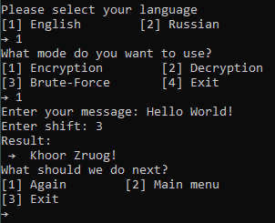
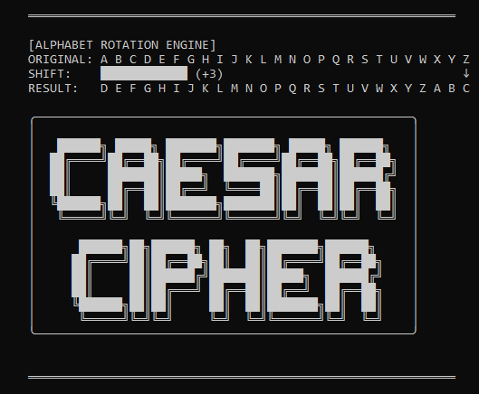

# Caesar Cipher Tool 🔐

A professional Python implementation of the Caesar cipher with encryption, decryption, and intelligent brute-force attack.

## 🚀 Features
- 🔒 **Encryption** with custom shift value
- 🔓 **Decryption** with known shift
- 🕵️ **Smart brute-force** mode with common word analysis
- 🎨 **Beautiful ASCII interface**
- 🛡️ **Full error handling**
- 🔄 **Case preservation** (uppercase/lowercase)
- 📊 **Confidence scoring** for brute-force results

## 🎮 Quick Example

**Encryption:**


## 📸 Preview


## 🛠️ Installation & Usage
```bash
# Clone the repository
git clone https://github.com/monsoon-resolve/caesar-cipher.git

# Run the program
cd caesar-cipher
python caesar_cipher.py
```
## 🧠 What I Learned
- Full program architecture design
- Error handling and input validation
- Text analysis and pattern recognition
- How to format Markdown
- How to work with git

## 🔮 Future Improvements
- Add support for multiple languages
- Add file encryption/decryption
- Implement other classical ciphers